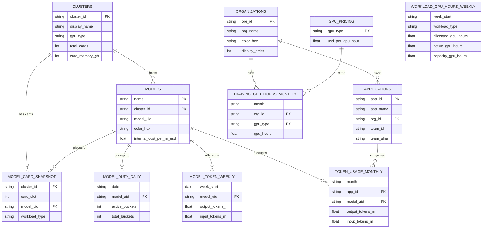
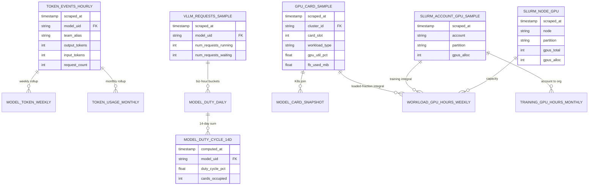

# Data Schema & ETL Design — GPU Farm Utilization Dashboard

> **Status: live contract + design proposal.** The dashboard now reads **normalized CSVs in `data/`** (the moderate-grain contract), aggregated in the browser by [`rollup.js`](rollup.js) into the render globals. This document is the **target normalized schema** the real upstream pipeline will populate, the rollup logic, and the contract the repo consumes. It is the bridge between "mockup" and "live."

The dashboard never changes shape when real data lands — only the CSVs are replaced. See [§5 Dashboard data contract](#5-dashboard-data-contract-moderate-grain--what-the-repo-actually-consumes).

---

## 1. The three layers

```
  SOURCE METRICS          ROLLUP TABLES            data/*.csv          rollup.js → globals     DASHBOARD
  (scraped, raw)          (upstream, raw→moderate) (contract, moderate)(in-browser aggregate)  (visuals)

  LiteLLM  /metrics  ─┐
  vLLM     /metrics  ─┼─►  raw scrape tables  ─►  fact_*.csv + dim_*.csv ─►  MODELS, CLUSTER_TOTAL,  ─► 6 visuals
  DCGM     /metrics  ─┤    (huge — 100k+ rows)    (small, hand-editable)     KPI, OUTPUT, SPLIT,        + KPI row
  K8s API            ─┘                                                      MODEL_TOKENS, COSTS …
        └──────────── upstream pipeline (future) ────────────┘   └──── this repo (rollup.js) ────┘
```

- **Source layer** — raw Prometheus / API scrapes. Names come from LiteLLM, vLLM, DCGM, K8s. Cataloged in-repo: [`litellm_prometheus_metrics.md`](litellm_prometheus_metrics.md), [`vllm_metrics.md`](vllm_metrics.md), [`DCGM_metrics.md`](DCGM_metrics.md).
- **Rollup layer (upstream, future)** — reset-aware counter diffs + business-hours bucketing turn raw into the **moderate-grain CSVs**. Heavy; lives in the external pipeline.
- **Contract + display (this repo, now)** — `data/*.csv` is the integration contract; `rollup.js` does the light final aggregation in the browser. No `data.js`, no build step.

---

## 2. Entity-Relationship Diagram

The model is shown as **two diagrams that share entity names**, so each renders legibly (the combined ERD is too wide to read in a preview pane):

- **§2a — Contract schema (what the dashboard reads today):** the dimension + fact CSVs in `data/` that `rollup.js` consumes. ✅ all materialised.
- **§2b — Upstream lineage (how the contract is produced):** the raw scrape / rollup tables the external ETL builds, each with an arrow to the contract fact it feeds. ⬜ design only — no CSV yet.

Attribute *prose* is omitted from the boxes to keep them legible — every column's meaning is in the **[§8 data dictionary](#8-data-dictionary--every-table--column)**. Keys (PK/FK) and relationships are shown in full.

### 2a. Contract schema — built today (the `data/*.csv` model)



> `WORKLOAD_GPU_HOURS_WEEKLY` carries no FK to the dimensions (it's keyed by week × workload_type) — it's fed entirely from upstream, so it floats here and connects in §2b.

### 2b. Upstream lineage — how the ETL builds the contract (future)

Raw scrape / rollup tables (boxes with attributes) feed the contract fact they produce (bare boxes — defined in §2a). ⬜ none materialised yet; this is the target for the external pipeline.



**On the model key.** `MODELS` is keyed by the **composite `(name, cluster_id)`** — the same model name (e.g. `glm5-1`) served on both B200 and H100 is two distinct rows, and the key survives redeploys. LiteLLM's autogenerated `model_id` is kept only as an attribute (it can change on redeploy, so it is *not* a key). For clean single-column joins, every fact/rollup table carries the surrogate **`model_uid = "{name}@{cluster_id}"`** as its FK to `MODELS`.

**On the consumer hierarchy (grounded in LiteLLM).** LiteLLM's native data model is **Organization → Team → User/Key** (`LiteLLM_OrganizationTable` ⟶ `LiteLLM_TeamTable.organization_id` FK ⟶ keys/users). This dashboard's hierarchy maps onto it directly:

| Dashboard level | LiteLLM entity | Emitted Prometheus label(s) | Stable key | Display |
|---|---|---|---|---|
| **Organisation** (`ORGANIZATIONS`) | Organization | `org_id`, `org_alias` | `organization_id` (UUID) | `organization_alias` |
| **Application** (`APPLICATIONS`) | **Team** | `team`, `team_alias` | `team_id` (UUID) | `team_alias` |
| **Model** (`MODELS`) | deployment | `model`, `model_id` | `(name, cluster_id)` | `name` |

Two consequences: (1) **`org_id`/`org_alias` are emitted directly on the token & request counters** — per-org attribution needs **no external lookup**; where a metric omits them (the deployment counter) join `team` → `LiteLLM_TeamTable.organization_id` → Organization. (2) An **Application is a LiteLLM Team** — so `app_id` carries `team_id` (stable UUID join key) + `team_alias` (emitted label). This only resolves cleanly if **each dashboard Application is its own LiteLLM Team**; apps finer than a team must be split by `key_alias`/`end_user` instead. Same stability rule as models: key on the UUID (`team_id`/`org_id`), display the alias (`team_alias`/`org_alias`).

---

## 3. Source layer — raw metrics

### Source A — LiteLLM proxy (`/metrics`) → token volume & team attribution
All counters; ETL must snapshot `(ts, value)` and compute **reset-aware** deltas.

| Metric | Used for | Key labels |
|---|---|---|
| `litellm_output_tokens_metric` | output token volume | `end_user`, `hashed_api_key`, `api_key_alias`, `requested_model`, `team`, `team_alias`, `user`, `model` + dynamically-appended **`org_id`, `org_alias`** |
| `litellm_input_tokens_metric` | input token volume | (same) |
| `litellm_proxy_total_requests_metric` | request counts (duty fallback) | `end_user`, `team`, `team_alias`, `user`, `requested_model`, `status_code`, `route`, `model_id` + **`org_id`, `org_alias`** |
| `litellm_deployment_total_requests` | per-deployment routing | `model_id`, `litellm_model_name`, `api_base`, `api_provider`, `team`, `team_alias` *(no `org_*` — not in `_org_label_metrics`)* |

> **Metric naming.** Names above are the **registered** metric names (per `litellm_prometheus_metrics.md`). The Prometheus exposition format appends `_total` to counters, so a scrape/`/metrics` dump may show e.g. `litellm_output_tokens_metric_total` — same series. The base label set is from the catalog; `org_id`/`org_alias` are **appended dynamically** by LiteLLM's `get_labels()` for metrics in `_org_label_metrics` (confirmed in source, see `litellm_team_hierarchy.md`).

- **Org/App attribution is native, not a lookup.** `org_id` (`= LiteLLM_OrganizationTable.organization_id`) and `org_alias` (`= organization_alias`) are emitted directly on the token & request counters (LiteLLM appends them via `_org_label_metrics`). `team`/`team_alias` identify the **Team** = the dashboard's *Application*. So the `team_alias → app → org` chain resolves from labels already present — **no external `team_alias → dept` table is required** (the old "HTD Mapping" blocker, now downgraded — see §7).
- The **deployment** counter omits `org_*`/`end_user`/`user` (it's provider/model-focused); to attribute it to an org, join its `team` label → `LiteLLM_TeamTable.organization_id`.
- `requested_model` = what the caller asked for; `litellm_model_name` = what was actually routed.
- `model_id` is LiteLLM's autogenerated deployment id (unique per model + api_base) — an attribute, not a key.
- `team_id`/`team_alias` (and `organization_id`/`organization_alias`) follow the alias-vs-id rule: the UUID is the stable key, the alias is the user-assigned display label (which can be renamed).

### Source B — vLLM engine (`/metrics`, per model pod) → **duty cycle**
| Metric | Type | Used for |
|---|---|---|
| `vllm:num_requests_running` | Gauge | **Duty cycle** — `>0` means the model had ≥1 request in execution at scrape time. % of business-hour windows with `>0` = duty %. |
| `vllm:num_requests_waiting` | Gauge | Queue depth / saturation context |
| `vllm:generation_tokens` | Counter | Engine-layer output tokens (cross-check vs LiteLLM) |
| `vllm:prompt_tokens` | Counter | Engine-layer input tokens |
| `vllm:request_success` | Counter | Completed requests |
| `vllm:kv_cache_usage_perc` | Gauge | Memory pressure on the model |

> `vllm:num_requests_running` is the **accurate** duty-cycle source (per model-serving process). LiteLLM `proxy_total_requests` is a fallback proxy-layer approximation.
>
> **`vllm:num_requests_running` carries `model_name` and `ray_model_name` as native labels** (confirmed in Grafana). Use `model_name` as the ETL join key to `dim_models.name`; `ray_model_name` is the Ray serving alias for the same value — pick one and use it consistently. The earlier assumption that model identity required the per-pod scrape target is now a fallback only. (If a deployment omits these labels, fall back to the scrape target `pod`/`job` label.)

### Source C — DCGM exporter (`/metrics`, per GPU) → **real GPU utilization, card loaded/idle, power**
| Metric | Type | Used for |
|---|---|---|
| `DCGM_FI_DEV_GPU_UTIL` | gauge | Real GPU utilization % → **Utilization by Workload** (Viz 2) |
| `DCGM_FI_PROF_GR_ENGINE_ACTIVE` | gauge | Finer "engine active" ratio (alternative to GPU_UTIL) |
| `DCGM_FI_PROF_PIPE_TENSOR_ACTIVE` | gauge | True compute intensity (tensor/HMMA pipe) |
| `DCGM_FI_DEV_FB_USED` | gauge | Framebuffer MiB used → **card is LOADED** if above idle baseline |
| `DCGM_FI_DEV_FB_FREE` | gauge | Framebuffer MiB free |

Labels (typical): `gpu` (slot index), `UUID`, `device`, `modelName` (the GPU model), `Hostname`, `DCGM_FI_DRIVER_VERSION`.

> DCGM gives a genuinely **real** utilization signal (stronger than duty cycle) and the physical loaded/idle state via `FB_USED`. The internal cost figures are **admin-provided** (see §7 / §9.5), not derived from energy.

### Source D — K8s API → model→card **placement** + **workload tag**
`k8s_pod_info`: `pod_name, namespace, node_name, gpu_slot, model_name, gpu_memory_request_mb, status`. Joins DCGM on `node_name + gpu_slot` to label each physical GPU with the model it serves (the card-allocation map, Viz 3b).

**Workload tagging** — each card's `workload_type` (`inference | training | batch`) is derived here from the pod's **K8s namespace or a GPU/pod label** (e.g. namespace `inference-*` → inference, a `workload=batch` label → batch). This tag rides along onto `gpu_card_sample` / `model_card_snapshot` and is what `workload_gpu_hours_weekly` groups by. Caveat: training runs on **Slurm** (separate hardware, now read via the Slurm exporter — Source E below) and the **Batch Inference Service** is still in pipeline — so only the **batch** row of `SPLIT` stays simulated ("Data Source: Pending").

### Source E — Slurm OpenMetrics exporter (`/metrics`) → **training GPU allocation + capacity**
Training runs on Slurm (separate hardware from the K8s/DCGM inference fleet). We read the **Slurm Prometheus exporter** — *not* `sacct` — so training enters the **same Prometheus pipeline** as every other source. These are **gauges** (current allocation), so training GPU-hours is a **time-integral of allocation**, derived exactly like inference GPU-hours (not a per-job elapsed sum).

| Metric | Type | Used for |
|---|---|---|
| `slurm_account_jobs_gpus_alloc{account}` | Gauge | **Training GPU-hours by org** — GPUs allocated per Slurm **account**; `account` is Slurm's native cost-center/org concept (the training analog of LiteLLM `org_id`). |
| `slurm_user_jobs_gpus_alloc{username}` | Gauge | Per-user allocation — **fallback** attribution if accounts aren't org-aligned (needs a `username → org` map). |
| `slurm_partition_jobs_gpus_alloc{partition}` | Gauge | Allocation per partition (partition usually ⇒ one GPU type → the `$/GPU-hr` rate). |
| `slurm_node_gpus{node}` / `slurm_partition_gpus{partition}` | Gauge | **Total training GPU inventory** → real capacity (kills the hard-coded card count). |
| `slurm_node_gpus_alloc{node}` | Gauge | Allocated GPUs per node → idle training capacity. |

> **Attribution key = `account`** (native, no lookup) *if* Slurm accounts are named per org (`account=htx`, `spf`, …). If jobs run under bare usernames, fall back to `slurm_user_jobs_gpus_alloc` + a `username → org` lookup (the training analog of the inference team mapping). **Open: confirm account structure with the platform team.**
> **`gpu_type`** (B200 vs H100, for the rate) isn't a label here — resolve it via a small `partition → gpu_type` map (Slurm partitions are typically hardware-homogeneous).

### ⚠ GPU-hours is DERIVED — there is no "GPU-hours" metric anywhere
DCGM exposes only **instantaneous** utilization gauges (`GPU_UTIL` %, `GR_ENGINE_ACTIVE` ratio) and a cumulative energy counter (mJ); Slurm exposes only **instantaneous** GPU-allocation gauges — **no card-time / GPU-hours field** exists on either side. GPU-hours = card-time, computed two ways:
- **Allocated GPU-hours** (cost/billing basis — the dashboard headline): the time a card was *held* by a workload.
  - Inference & batch → **K8s API**: pod GPU allocation × duration (namespace = workload). In our pipeline: `(# of `gpu_card_sample` rows where workload=X and loaded) × scrape_interval`.
  - Training → **Slurm exporter** (`SLURM_ACCOUNT_GPU_SAMPLE`): `∫ slurm_account_jobs_gpus_alloc dt` ≈ `avg_over_time(gauge) × hours`. Training jobs are long-running, so the gauge is stable and the integral is accurate at scrape resolution.
- **Active GPU-hours** (efficiency refinement — optional footnote): `∫ (DCGM_FI_DEV_GPU_UTIL/100) dt` ≈ `Σ(gpu_util_pct/100) × scrape_interval`. This is the only place DCGM feeds GPU-hours.

`capacity_gpu_hours` = total farm cards × hours in the week (inference fleet 50 + training nodes 8 = 58 → 58 × 168 h ≈ 9,744 card-hrs/week). `idle = capacity − Σ allocated`.

---

## 4. Rollup layer — tables this repo builds

| Table | Grain | Built from | Feeds |
|---|---|---|---|
| `token_events_hourly` | hour × model_uid × team_alias | LiteLLM token + request counters (reset-aware deltas) | downstream token rollups, duty fallback |
| `vllm_requests_sample` | scrape × model_uid | vLLM gauges (raw timestamps, unfiltered) | `model_duty_cycle_14d` |
| `gpu_card_sample` | scrape × card | DCGM gauges + K8s `workload_type` tag | `workload_gpu_hours_weekly`, `model_card_snapshot` |
| `model_card_snapshot` | snapshot × card | K8s placement ⨝ `gpu_card_sample` (FB_USED) | `model_card_loaded_snapshot`, duty `cards_occupied` |
| `model_duty_daily` | day × model_uid | `vllm_requests_sample`, SGT biz-hours filter, fixed buckets | `model_duty_cycle_14d` (intermediate — the dashboard contract grain) |
| **`model_duty_cycle_14d`** | model_uid | `model_duty_daily` summed over the window | `MODELS[].duty`, KPI duty |
| **`workload_gpu_hours_weekly`** | week × workload_type | `gpu_card_sample` (allocated = loaded card-samples × interval; active = Σ util×interval) + Slurm exporter (`∫ gpus_alloc`) for training | `SPLIT` (% of capacity + idle) |
| **`model_token_weekly`** | week × model_uid | `token_events_hourly` grouped by ISO week | `MODEL_TOKENS` |
| **`token_usage_monthly`** | month × app_id × model | `token_events_hourly` ⨝ `applications` (team_alias→app→org) | `INFERENCE_TREE` (Viz 4), token KPI |
| **`training_gpu_hours_monthly`** | month × org × gpu_type | Slurm exporter `slurm_account_jobs_gpus_alloc` integrated, grouped by account→org | `TRAINING_BY_ORG` (Viz 4) |

**Duty cycle definition (the crux metric):**

1. **Scrape raw, store timestamps.** `vllm_requests_sample` keeps every `(scraped_at, model_uid, num_requests_running)` sample **unfiltered**. Prometheus stores each scrape as a `(timestamp, value)` pair, so the timestamp is always available — we never pre-filter at scrape time.
2. **Filter to business hours in the rollup**, timezone-aware (SGT): `rollup_duty_cycle.py` keeps only samples where, in `Asia/Singapore` local time, `day_of_week ∈ Mon–Fri` and `hour ∈ [09, 18)`. Because the window is a *rollup-time* filter, the definition can change later without re-scraping.
3. **Bucket and score.** Divide the business-hour window (last 14 days) into **fixed buckets** (e.g. 5-min). A bucket is **active** if `num_requests_running > 0` at any sample within it. Duty cycle = `active buckets / total business-hour buckets`. Fixed buckets make the number **independent of the scrape interval** (raw "% of samples active" would drift if the scrape rate changed).

This is "% of *time* with ≥1 running request," **not** GPU busyness and **not** token volume — which is exactly why "loaded ≠ utilized." (DCGM `GPU_UTIL` is the separate "how hard the GPU worked" signal, used for Utilization-by-Workload.)

---

## 5. Dashboard data contract (moderate grain) — what the repo actually consumes

The dashboard does **not** read the raw source tables above. It reads a small set of **moderate-grain CSVs** in `data/` — the **integration contract** between the (future, upstream) pipeline and this repo. `rollup.js` fetches them in the browser and does the **light final aggregation** into the render globals. No build step, no backend.

**Why moderate, not raw?** Raw scrape-level facts are huge — duty alone is ~17k rows (≈170k at 30-s scrape), DCGM per-card + hourly token counters run to 100k+. That's over the practical hand-edit / in-browser-parse limit. So the **heavy raw→moderate work** (reset-aware counter diffs, business-hours bucketing) happens **upstream** (§3–4 / §7 scripts); the CSVs land already bucketed/diffed. The in-repo rollup logic stays stable as long as the upstream emits these same columns.

**CSV file → ERD table → render global:**

| `data/*.csv` (contract) | ERD table | Feeds (global) |
|---|---|---|
| `dim_clusters.csv` | CLUSTERS | `CLUSTER_TOTAL` |
| `dim_models.csv` | MODELS | `MODELS[].color`, `COSTS` |
| `dim_organizations.csv` | ORGANIZATIONS | `ORGS`, `ORG_COLOR` |
| `dim_applications.csv` | APPLICATIONS | org→app hierarchy for Viz 4 |
| `dim_gpu_pricing.csv` | GPU_PRICING | $/GPU-hour for training cost |
| `fact_card_snapshot.csv` | MODEL_CARD_SNAPSHOT | `MODELS[].cards`, donut, card map |
| `fact_duty_daily.csv` | MODEL_DUTY_DAILY | `MODELS[].duty` (Σactive/Σtotal), KPI duty |
| `fact_token_usage_monthly.csv` (month × **app_id** × model) | TOKEN_USAGE_MONTHLY | `INFERENCE_TREE` (org→app→model + cost), token KPI |
| `fact_training_gpu_hours_monthly.csv` (month × org × gpu_type) | TRAINING_GPU_HOURS_MONTHLY | `TRAINING_BY_ORG` (GPU-hrs + cost) |
| `fact_model_token_weekly.csv` | MODEL_TOKEN_WEEKLY | `MODEL_TOKENS`, cost token-weights |
| `fact_workload_util.csv` (weekly GPU-hours: allocated, active, capacity) | WORKLOAD_GPU_HOURS_WEEKLY | `SPLIT` (% of capacity + idle), farm-util headline, `COMPUTE_SPLIT` inference hrs |
| `fact_model_pricing.csv` (model × provider) | (price sheet) | Viz 5 cost table |

The contract preserves the coherence invariants (Σ model cards = loaded; per-cluster loaded + idle = total; fleet duty computed not typed). To swap in real data, replace the CSVs (same columns) — `rollup.js` and `index.html` don't change.

---

## 6. ETL split — upstream (future) vs in-repo (now)

**In-repo (now): `rollup.js`** — the *moderate→display* step. Fetches `data/*.csv`, aggregates, exposes globals. This is the only ETL that runs at view time.

**Upstream (future, external pipeline): the *raw→moderate* step** — produces the contract CSVs from the live metric sources. These scripts live in the pipeline, not this repo:

| Script | Reads | Writes (→ contract CSV) |
|---|---|---|
| `scrape_litellm.py` | LiteLLM `/metrics` | `token_events_hourly` |
| `scrape_vllm.py` | vLLM `/metrics` (per model pod) | `vllm_requests_sample` |
| `scrape_dcgm.py` | DCGM exporter `/metrics` | `gpu_card_sample` |
| `scrape_k8s.py` | K8s API pod list (namespace/label → `workload_type`) | `model_card_snapshot` (⨝ `gpu_card_sample`) |
| `rollup_tokens.py` | `token_events_hourly` + `dim_applications` (team_alias→app→org) | `fact_model_token_weekly`, `fact_token_usage_monthly` |
| `rollup_duty_cycle.py` | `vllm_requests_sample` (SGT biz-hours filter, fixed buckets) | `fact_duty_daily` → `model_duty_cycle_14d` |
| `scrape_slurm.py` | Slurm exporter `/metrics` (`slurm_account_jobs_gpus_alloc`, `slurm_node_gpus`) | `slurm_account_gpu_sample`, `slurm_node_gpu` |
| `rollup_workload_gpu_hours.py` | `gpu_card_sample` (allocated + active GPU-hrs by workload) + Slurm exporter (`∫ gpus_alloc`, training) | `fact_workload_util` (weekly GPU-hours) |
| `rollup_training_gpu_hours.py` | `slurm_account_gpu_sample` integrated, account→org | `fact_training_gpu_hours_monthly` |

(The old `export_data_js.py` is obsolete — the dashboard reads CSVs directly via `rollup.js`, not a generated `data.js`.)

---

## 7. Open items / blockers

- **Org/App attribution — RESOLVED for inference (was "Showback: Preliminary").** Confirmed against LiteLLM source (`schema.prisma`, `litellm/types/integrations/prometheus.py`): the proxy's native hierarchy is **Organization → Team → User/Key**, and the token/request counters emit **`org_id`, `org_alias`, `team`, `team_alias`** directly. So per-org and per-app (=Team) attribution needs **no external lookup** — `dim_organizations`/`dim_applications` just label the UUIDs the metrics already carry. Remaining decision: **each dashboard Application must be its own LiteLLM Team** (1 app = 1 team); apps finer than a team must instead be split by `key_alias`/`end_user`.
- **Training attribution — now native Prometheus (was hand-authored `sacct`).** Confirmed against the Slurm OpenMetrics exporter (`Slurm_metrics.md`): training reads `slurm_account_jobs_gpus_alloc{account}` integrated over time, and capacity from `slurm_node_gpus` — same Prometheus pipeline as the inference sources, and it supplies real training inventory (so the farm card count is measured, not asserted). One open dependency, mirroring the 1-app-=-1-team question: **are Slurm accounts named per org?** If yes, attribution is native (no lookup); if jobs run under bare usernames, a `username → org` map (`slurm_user_jobs_gpus_alloc`) is still needed. Also needs a small `partition → gpu_type` map for the cost rate. **Confirm account structure with platform.**
- **Workload tagging** — `workload_type` is derived from the pod's K8s namespace/label in `scrape_k8s.py`. Inference is covered by K8s/DCGM; **training is now sourced from the Slurm exporter** (`SLURM_ACCOUNT_GPU_SAMPLE`, separate from K8s/DCGM). Only **batch** remains unsourced until the Batch Inference Service ships — so just the batch row of `SPLIT` stays simulated. Inference tagging still needs a documented K8s namespace/label convention to be reliable.
- **Internal cost rates — admin-provided (resolved by decision).** `dim_models.internal_cost_per_m_usd` (token $/1M) and `dim_gpu_pricing.usd_per_gpu_hour` (training $/GPU-hr) are **governance/policy inputs the dashboard admin sets by hand** — the same model as the external price sheet (`fact_model_pricing.csv`). They are **not derived from any source metric** (DCGM power/energy is used for idle/efficiency only, not cost). No pipeline gap — this is intentional admin input.
- **Counter resets** — every `_total` counter resets on pod restart; all delta rollups must be reset-aware.
- **vLLM vs LiteLLM token cross-check** — `vllm:generation_tokens` should approximately reconcile with `litellm_output_tokens_metric`; divergence flags proxy/engine accounting gaps.

---

## 8. Data dictionary — every table & column

Conventions: **Grain** = what exactly one row represents. *PK* = primary key, *FK* = foreign key. `model_uid` = `"{name}@{cluster_id}"` everywhere. Tokens are in **millions (M)**; GPU-hours are **card-hours** (1 card busy for 1 hour = 1 GPU-hour).

### 8.1 Dimension tables — `data/dim_*.csv` (hand-maintained reference; rarely change)

**`dim_clusters.csv`** — the physical **inference GPU pools**. One row per cluster. Drives the donut totals and the card-map panels. (Training nodes are *not* a cluster — they're separate Slurm hardware and enter only via the GPU-hours capacity.)

| column | type | meaning | units / example |
|---|---|---|---|
| `cluster_id` | string **PK** | stable cluster code; the FK target used by every card/sample fact | `B200` |
| `display_name` | string | label shown on the dashboard | `SUPERPOD` |
| `gpu_type` | string | GPU model in this cluster | `B200` |
| `total_cards` | int | physical cards in the cluster (loaded **+** idle) | `32` |
| `card_memory_gb` | int | HBM per card | GB · `192` |

**`dim_models.csv`** — one row per **model served on a cluster**. Composite PK `(name, cluster_id)`: the same model on two clusters = two rows. Drives model colours, the cost chart, and cost weighting.

| column | type | meaning | units / example |
|---|---|---|---|
| `name` | string **PK** | model name = vLLM/LiteLLM `litellm_model_name` | `glm5-1` |
| `cluster_id` | string **PK**, FK→`dim_clusters` | hosting cluster | `B200` |
| `model_uid` | string | surrogate `name@cluster_id`; the single-column FK used by all facts | `glm5-1@B200` |
| `color_hex` | string | dashboard colour (card squares, Viz 6 band) | `#0071E3` |
| `internal_cost_per_m_usd` | float | **admin-set** self-hosted cost per **1M output tokens** (governance rate, not metric-derived); **single source** for the Internal column of Viz 5 and the Viz 4 inference cost | USD · `0.15` |

> External (public-cloud / open-host) prices are **not** here — they live per-host in `fact_model_pricing.csv` (§8.2). The former `public_api_equiv` / `public_cost_per_m_usd` columns were dropped when Viz 5 became the multi-host table.

**`dim_organizations.csv`** — one row per **Organisation** (top of the consumer hierarchy). Controls Viz 4 org order + colours.

| column | type | meaning | units / example |
|---|---|---|---|
| `org_id` | string **PK** | stable org code (FK target for facts) = LiteLLM `organization_id` (a UUID in real data; mock uses readable codes), emitted label `org_id` | `spf` |
| `org_name` | string | display name = LiteLLM `organization_alias`, emitted label `org_alias` | `SPF` |
| `color_hex` | string | row dot colour | `#34C759` |
| `display_order` | int | listing order | `2` |

**`dim_applications.csv`** — one row per **Application = LiteLLM Team** (mid level). `code-assist-users` recurs across orgs, so an app is identified by **(org, app)** via a unique `app_id`. The `team_id`/`team_alias` columns bind each row to its LiteLLM Team so the dimension is **mappable straight from the raw Prometheus labels** (`team`/`team_alias`), and the owning org comes from the metric's native `org_id`/`org_alias`.

| column | type | meaning | units / example |
|---|---|---|---|
| `app_id` | string **PK** | dashboard slug (convenience key wired into the facts) | `spf-code-assist` |
| `app_name` | string | display name (may repeat across orgs) | `code-assist-users` |
| `org_id` | string FK→`dim_organizations` | owning organisation (= LiteLLM `Team.organization_id`) | `spf` |
| `team_id` | string | LiteLLM `team_id` (UUID) — **stable join key** to the raw `team` label | `team_d4b8e2a7` |
| `team_alias` | string | LiteLLM `team_alias` — the emitted human-readable label | `spf-code-assist` |

### 8.2 Fact / contract CSVs — `data/fact_*.csv` (what the dashboard actually reads)

> **Carried-but-unused columns (forward-use).** A few contract columns are populated and meaningful but **not consumed by `rollup.js` today** — kept for forward use / as grain keys, not rendered: `input_tokens_m` in both `fact_token_usage_monthly` and `fact_model_token_weekly` (only `output_tokens_m` is rendered since Viz 4 dropped the Input/Output toggle); `workload_type` in `fact_card_snapshot` (the card map colours by model, not workload); `date` in `fact_duty_daily` (a grain key — duty is summed over the window, the individual date isn't read). They remain part of the contract so the ETL can keep emitting them.

**`fact_card_snapshot.csv`** — **Grain: one physical GPU card** (latest snapshot). Source of truth for "what model sits where / what's idle." Feeds the donut, card map, `MODELS.cards`, and cluster idle counts.

| column | type | meaning | units / example |
|---|---|---|---|
| `cluster_id` | string FK→`dim_clusters` | cluster the card is in | `B200` |
| `card_slot` | int | 0-indexed GPU slot within the cluster | `0` |
| `model_uid` | string FK→`dim_models` | model occupying the card; **blank ⇒ idle** | `glm5-1@B200` |
| `workload_type` | string | `inference` \| `training` \| `batch`; blank if idle | `inference` |

**`fact_serving_curve.csv`** — **Grain: one benchmark operating point (model × precision × TP × concurrency).** Feeds the Fleet Token Capacity hero band (`THROUGHPUT`, `THROUGHPUT_CEILING`).

> **Unlike every other fact in this contract, this is NOT observed on our fleet.** It is a *serving benchmark* (NVIDIA inference performance tool, ISL/OSL 8K/1K) describing what each model **could** do on this hardware. The dashboard joins it to `fact_card_snapshot` (what we actually run) to produce a **ceiling**. Real inputs, modelled output. Full derivation: `RAW_DATA/system_throughput/METHODOLOGY.md`.

| column | type | meaning | units / example |
|---|---|---|---|
| `model_uid` | string FK→`dim_models` | the model this curve describes | `glm5-1@B200` |
| `precision` | string | weight quantisation of the benchmarked deployment | `fp4` \| `fp8` \| `fp16` \| `unknown` |
| `tp` | int | tensor-parallel size — GPUs one replica is sharded across | `4` |
| `cu` | float | concurrent users **per replica** at this point | `32` |
| `interactivity_tps_user` | float | output speed **one user** sees at this (TP, CU) | `55.6` |
| `source` | string | provenance — `measured` (real) \| `simulated` (mock). **No proxies or estimates**: a model appears here only if it was actually benchmarked. | `measured` |

**How `rollup.js` consumes it.** Decode is memory-bandwidth-bound, so per-user latency is linear in concurrency: `1/interactivity = a + b·CU`. Fit `(a,b)` per (model, TP) by least squares on the measured points, solve `CU` at `INTERACTIVITY_SLA` (60), then `tok/s per GPU = CU × SLA ÷ TP` and `total = Σ (tok/s per GPU × cards)`. Two hard rules: **CU ≥ 1** (a model that can't serve even one user at the SLA counts as 0) and **TP ≤ that model's card count**.

> **The denominator is the cards these models occupy — NOT the cluster.** A loaded model absent from this fact is **out of scope**: excluded from both numerator and denominator, its GPU count surfaced as `THROUGHPUT_CEILING.outOfScopeGpus` and named in the panel caption. Folding it in at zero would drag the per-GPU average down and understate the models that *were* measured. To widen the scope, benchmark more models.

> **Deliberately NOT a column: `tokps_per_mw`.** The raw benchmark exports carry it, but it is redundant — `tok/s/GPU = CU × interactivity ÷ TP` (verified to 0.5% on all 14 measured points) — and carrying it would drag the tool's admin-set 2.17 kW/GPU power constant into the dashboard for no reason. It is dropped by the ETL.

**`fact_duty_daily.csv`** — **Grain: one model × one business-day.** Pre-bucketed inputs to the 14-day duty cycle. Duty % = `Σ active_buckets ÷ Σ total_buckets` over the window.

| column | type | meaning | units / example |
|---|---|---|---|
| `date` | string | business day, **SGT** | YYYY-MM-DD · `2026-06-05` |
| `model_uid` | string FK | model | `glm5-1@B200` |
| `active_buckets` | int | 5-min **business-hour** buckets that day with `vllm:num_requests_running > 0` | count · `91` |
| `total_buckets` | int | business-hour buckets that day (9h × 12) | count · `108` |

**`fact_token_usage_monthly.csv`** — **Grain: one month × application × model.** Attributed token volume. Latest month → the Viz 4 **Org → App → Model** drill (app→org via `dim_applications`); monthly fleet sum → token KPI. **Token cost** = `output_tokens_m × dim_models.internal_cost_per_m_usd` (computed in `rollup.js`).

| column | type | meaning | units / example |
|---|---|---|---|
| `month` | string | calendar month label | `Jun` |
| `app_id` | string FK→`dim_applications` | consuming application (→ org) | `spf-code-assist` |
| `model_uid` | string FK→`dim_models` | model that produced the tokens | `glm5-1@B200` |
| `output_tokens_m` | float | **output** (generated) tokens | millions · `15` |
| `input_tokens_m` | float | **input** (prompt) tokens | millions · `30` |

**`fact_training_gpu_hours_monthly.csv`** — **Grain: one month × org × gpu_type.** Per-org training GPU-hours (the Viz 4 Training drill). **Cost** = `gpu_hours × dim_gpu_pricing.usd_per_gpu_hour`.

| column | type | meaning | units / example |
|---|---|---|---|
| `month` | string | calendar month label | `Jun` |
| `org_id` | string FK→`dim_organizations` | org that ran the training | `htx` |
| `gpu_type` | string FK→`dim_gpu_pricing` | GPU model used (drives the rate) | `B200` |
| `gpu_hours` | float | training card-hours that month | card-hrs · `2400` |

**`dim_gpu_pricing.csv`** — one row per **gpu_type**: the internal $/GPU-hour used for training cost.

| column | type | meaning | units / example |
|---|---|---|---|
| `gpu_type` | string **PK** | GPU model | `B200` |
| `usd_per_gpu_hour` | float | **admin-set** internal $/GPU-hr (governance rate; not metric-derived) | USD · `4.00` |

**`fact_model_token_weekly.csv`** — **Grain: one week × model.** Weekly output/input by model (Viz 6). 4 weeks per month; each month's 4 weeks sum to that month's fleet total (so Viz 6 ties to the monthly KPI).

| column | type | meaning | units / example |
|---|---|---|---|
| `week_start` | string | week label (4/month, aligns with Viz 2) | `Jun 16` |
| `model_uid` | string FK→`dim_models` | model | `glm5-1@B200` |
| `output_tokens_m` | float | output tokens that week | millions · `23.4` |
| `input_tokens_m` | float | input tokens that week | millions · `46.8` |

**`fact_workload_util.csv`** — **Grain: one week × workload_type.** GPU-hours by workload (Viz 2). ⚠ **GPU-hours are derived card-time, not a measured metric** (see §9). util % = `allocated ÷ capacity`; idle % = `(capacity − Σ allocated) ÷ capacity`.

| column | type | meaning | units / example |
|---|---|---|---|
| `week_start` | string | week label | `Jun 16` |
| `workload_type` | string | `inference` \| `training` \| `batch` | `inference` |
| `allocated_gpu_hours` | float | **card-hours the workload HELD** (occupancy / cost basis). K8s pod-allocation time (inference/batch) or Slurm exporter `∫ gpus_alloc` (training). Not DCGM. | card-hrs · `4291` |
| `active_gpu_hours` | float | **effective compute hours** = `∫(GPU_UTIL/100) dt`. Always ≤ allocated. The efficiency view. | card-hrs · `1955` |
| `capacity_gpu_hours` | float | total farm card-hours available = `total_cards × 168`. The denominator. | card-hrs · `9744` |

**`fact_model_pricing.csv`** — **Grain: one model × EXTERNAL provider.** The external-host prices for the Viz 5 cost-comparison table. **User-maintained** (not derived — see §9.5). Long format, so adding a provider row = a new column automatically. **The internal "self-hosted" column is NOT here — it's sourced from `dim_models.internal_cost_per_m_usd`** (single source, shared with Viz 4). Any `Internal …` rows in this file are ignored.

| column | type | meaning | units / example |
|---|---|---|---|
| `model` | string | model name (matches `dim_models.name`) | `glm5-1` |
| `provider` | string | external host serving the model | `OpenRouter`, `Together AI` |
| `output_usd_per_m` | float | **output** (completion) price per 1M tokens; **blank ⇒ "—"** in the table | USD · `0.55` |

Rendered: top-5 models by token volume × [Internal (from `dim_models`)] + the distinct external providers. The **cheapest cell per row is highlighted**; the headline = token-weighted % Internal is cheaper than each model's cheapest external host (hidden if no external prices are filled).

### 8.3 Upstream source & rollup tables (future pipeline — not in this repo yet)
These are produced by the external pipeline (§3, §6); the contract CSVs above are their moderate-grain exports. Column details live inline in the ERD (§2); grain summary:

| table | grain (one row =) | purpose |
|---|---|---|
| `token_events_hourly` | hour × model × team_alias | reset-aware token & request **deltas** from LiteLLM counters |
| `vllm_requests_sample` | scrape × model | raw vLLM `num_requests_running` gauge (duty source; biz-hours filtered in rollup) |
| `gpu_card_sample` | scrape × physical card | raw DCGM gauges + K8s `workload_type` tag (GPU-hours + loaded/idle source) |
| `slurm_account_gpu_sample` | scrape × account | Slurm exporter `slurm_account_jobs_gpus_alloc` gauge → training GPU-hours via `∫ gpus_alloc dt` |
| `slurm_node_gpu` | scrape × node | Slurm exporter `slurm_node_gpus` → real training capacity |
| `model_card_snapshot` | snapshot × card | model→card placement (K8s ⨝ DCGM `FB_USED`) |
| `model_duty_daily` | day × model | business-hour active/total bucket counts → `fact_duty_daily` |
| `model_duty_cycle_14d` | model | final 14-day duty % |
| `workload_gpu_hours_weekly` | week × workload_type | allocated/active/capacity GPU-hours → `fact_workload_util` |
| `model_token_weekly` | week × model | weekly token rollup → `fact_model_token_weekly` |
| `token_usage_monthly` | month × app × model | monthly token rollup (team_alias→app→org) → `fact_token_usage_monthly` |
| `training_gpu_hours_monthly` | month × org × gpu_type | Slurm exporter account→org → `fact_training_gpu_hours_monthly` |

---

## 9. Rollup query reference — how each value is computed

Assume DCGM samples carry labels `gpu`, `Hostname`, and a `workload` label (from the K8s namespace/pod label join), and that the Prometheus scrape interval is **`$step`** (e.g. 5m). "Loaded" baseline = framebuffer above idle (~1 GiB).

### 9.1 Workload GPU-hours (Viz 2) — `rollup_workload_gpu_hours`

GPU-hours = the **time-integral of occupancy/utilization**, i.e. `mean_over_the_week × card-hours_available`. Three numbers per `(week, workload)`:

**(a) Allocated GPU-hours** — card-time the workload *held* (the cost/billing basis). Inference from K8s/DCGM occupancy; training from the Slurm exporter (skip training until Slurm is ingested).

> ⚠ **`workload` label requires K8s tagging** — DCGM metrics do not carry a `workload` label natively. Until K8s namespace/label tagging is wired into the scrape pipeline, treat **all DCGM data as `inference`** (training is skipped; batch is pending). Remove `by (workload)` and hardcode `workload_type = 'inference'` in the ETL output for now.

```promql
# Inference — fraction of the week each card was loaded, × card-hours available.
# (DCGM_FI_DEV_FB_USED is in MiB; >1024 ≈ a model is resident.)
# $step = your Prometheus scrape interval (e.g. 15s or 60s)
sum(
  avg_over_time( (DCGM_FI_DEV_FB_USED > bool 1024)[1w:$step] )  # 0/1 per scrape → "loaded fraction"
) * (24 * 7)                                                    # × hours in the week  → card-hours
# Output: one value → fact_workload_util row (week_start, 'inference', allocated_gpu_hours)
```
```promql
# Training — integrate the Slurm allocation gauge over the week (same shape as inference):
sum by (account) (
  avg_over_time( slurm_account_jobs_gpus_alloc[1w:$step] )   # mean GPUs held over the week
) * (24 * 7)                                                 # × hours  → GPU-hours
# (training jobs are long-running, so the gauge is stable and the integral is accurate.)
```

**(b) Active GPU-hours** — effective compute (efficiency view); `DCGM_FI_DEV_GPU_UTIL` is time-averaged over DCGM's ~1s internal sample period (not instantaneous) — averaging over a week gives a meaningful signal:
```promql
# Same workload caveat as (a) — remove by (workload) until K8s tagging is wired.
sum(
  avg_over_time( DCGM_FI_DEV_GPU_UTIL[1w:$step] ) / 100     # mean utilization 0..1 per card
) * (24 * 7)                                                # × card-hours  → "compute hours"
# (swap GPU_UTIL → DCGM_FI_PROF_PIPE_TENSOR_ACTIVE for true tensor-core MFU.)
```

**(c) Capacity & derived display values:**
```text
capacity_gpu_hours = total_farm_cards × 24 × 7          # 58 × 168 = 9,744 / week
utilization_%(workload) = allocated_gpu_hours / capacity_gpu_hours × 100
idle_%                  = (capacity_gpu_hours − Σ allocated_gpu_hours) / capacity_gpu_hours × 100
compute_intensity_%     = Σ active_gpu_hours / Σ allocated_gpu_hours × 100   # the footnote stat
```
Writes one `fact_workload_util.csv` row per `(week_start, workload_type)` with `allocated_gpu_hours, active_gpu_hours, capacity_gpu_hours`.

> ⚠ **There is no `..._GPU_HOURS` metric on any source.** GPU-hours is always `Σ(fraction-busy or GPUs-held per scrape) × hours`, i.e. a time-integral over scrape samples. DCGM supplies the per-scrape *fraction* (`GPU_UTIL`) or *loaded* flag (`FB_USED`); the Slurm exporter supplies the per-scrape *GPUs allocated* (`slurm_account_jobs_gpus_alloc`). Both are integrated the same way.

### 9.2 Duty cycle (Viz 1) — `rollup_duty_cycle`

**Definition:** per model, the share of **business-hour 5-min buckets** (Mon–Fri 09:00–18:00 **SGT**, last 14 days) in which the model had ≥1 request executing. The raw signal is vLLM's `vllm:num_requests_running` (gauge). **`model_name` is a confirmed native label** (verified in Grafana) — use it directly; `ray_model_name` is an alias for the same value. Business-hours filtering is done **in the rollup** (not at scrape) — pure-PromQL calendar masking is awkward — so the authoritative logic is SQL over the raw `vllm_requests_sample` table.

**Step 0 — map `model_name` → `model_uid`** (ETL pre-step, before the SQL below):
```text
model_uid = model_name + "@" + cluster_id
-- cluster_id looked up from dim_models WHERE name = model_name
-- (each model is deployed on exactly one cluster; dim_models is the authority)
```

```sql
-- Step 1: per-day rows → fact_duty_daily
WITH biz AS (                                   -- keep only Mon–Fri 09:00–18:00 SGT samples
  SELECT model_uid, scraped_at, num_requests_running
  FROM   vllm_requests_sample
  WHERE  scraped_at >= now() - INTERVAL '14 days'
    AND  EXTRACT(dow  FROM scraped_at AT TIME ZONE 'Asia/Singapore') BETWEEN 1 AND 5
    AND  EXTRACT(hour FROM scraped_at AT TIME ZONE 'Asia/Singapore') BETWEEN 9 AND 17
), buckets AS (                                 -- 5-min bucket per model per day: active if ANY sample > 0
  SELECT model_uid,
         DATE(scraped_at AT TIME ZONE 'Asia/Singapore') AS day,
         to_timestamp(floor(extract(epoch FROM scraped_at) / 300) * 300) AS bucket,
         MAX((num_requests_running > 0)::int) AS active
  FROM   biz GROUP BY 1, 2, 3
)
-- fact_duty_daily: one row per (date, model_uid)
SELECT model_uid,
       day                  AS date,
       SUM(active)          AS active_buckets,
       COUNT(*)             AS total_buckets
FROM   buckets GROUP BY model_uid, day;

-- Step 2: rollup.js sums active_buckets / total_buckets across the 14-day window → duty_cycle_pct
-- Fleet/KPI duty = Σ(duty×cards)/Σcards (computed in rollup.js, never typed)
```
PromQL for the raw 0/1 "active now" signal (if building as a recording rule instead): `clamp_max(vllm:num_requests_running, 1)`.

### 9.3 Token rollups (Viz 4 & 6) — `rollup_tokens`

LiteLLM exposes monotonic counters `litellm_output_tokens_metric` and `litellm_input_tokens_metric` (labels `model`, `team`, `team_alias`, `org_id`, `org_alias`, …; counters surface as `…_total` in the raw exposition). `increase()` is **reset-aware**, so it transparently handles pod restarts:

```promql
# fact_model_token_weekly — output by model, per ISO week (millions):
sum by (model)            (increase(litellm_output_tokens_metric[1w])) / 1e6
sum by (model)            (increase(litellm_input_tokens_metric [1w])) / 1e6

# fact_token_usage_monthly — by org × team(app) × model, per month (millions).
# org_id/org_alias and team/team_alias are NATIVE labels — no external lookup needed:
sum by (org_alias, team_alias, model)(increase(litellm_output_tokens_metric[30d])) / 1e6
sum by (org_alias, team_alias, model)(increase(litellm_input_tokens_metric [30d])) / 1e6
```

**`model` label → `model_uid` mapping (post-query ETL step):**
```text
-- LiteLLM emits model_name only (e.g. "glm5-1"); fact tables need model_uid (e.g. "glm5-1@B200").
-- Join on dim_models.name = model label to get cluster_id, then:
model_uid = model + "@" + cluster_id
-- If a model_name is not found in dim_models (e.g. a model not in the dashboard), drop that row.
```

**`team_alias` → `app_id` mapping (for `fact_token_usage_monthly` only):**
```text
-- team_alias from the metric (e.g. "spf-code-assist") → app_id via dim_applications.team_alias
-- org_alias from the metric maps directly to dim_organizations.org_name (display) / org_id (key)
```

Then: weekly-by-model → `fact_model_token_weekly` (Viz 6); org×team×month → `app_id` via `dim_applications` → `fact_token_usage_monthly` (Viz 4 Org→App→Model drill + token KPI; cost join in §9.6). Cross-check: `vllm:generation_tokens` should ≈ the LiteLLM output total. (For exact accounting prefer summed recording-rule deltas over a single long-range `increase()`, which extrapolates slightly.)

### 9.4 Loaded % & card map (Viz 3) — `rollup_card_snapshot`

A card is **loaded** if a model's weights are resident (framebuffer above idle). Placement (which model) comes from K8s; occupancy from DCGM:

```promql
# loaded cards per cluster right now (FB_USED in MiB; >1 GiB ⇒ a model is resident):
count by (cluster) (DCGM_FI_DEV_FB_USED > 1024)
# loaded_% = above ÷ dim_clusters.total_cards ;  idle = total_cards − loaded
```
Model→card identity: join K8s `kube_pod_info` / device-plugin allocation to the DCGM series on `(Hostname, gpu)` → write one `fact_card_snapshot` row per physical card with its `model_uid` (blank ⇒ idle) and `workload_type`.

### 9.5 Cost comparison (Viz 5) — `fact_model_pricing.csv` (user-maintained)

**Both prices are admin-provided inputs — neither is derived from a source metric.** The **internal** price is `dim_models.internal_cost_per_m_usd` (the single source, shared with the Viz 4 inference cost); the **external** host prices are a **hand-filled sheet** `fact_model_pricing.csv` (the rendered web catalogs are JS apps / incomplete for these models). `rollup.js` injects Internal as the first column, then computes:
```text
internal(model)          = dim_models.internal_cost_per_m_usd           # admin-set governance rate
cheapest_external(model) = min(output_usd_per_m over external providers in fact_model_pricing)   # admin-filled
savings(model)           = (cheapest_external − internal) / cheapest_external          # may be negative
headline_%               = Σ(savings(model) × tokens_model) / Σ(tokens_model) × 100     # token-weighted, top-5
#   tokens_model from fact_model_token_weekly; headline hidden if no external prices filled.
```

> **No energy-derivation.** Internal cost is a **policy figure the admin maintains** (depreciation, power, staffing folded in at the admin's discretion) — the dashboard reads it as-is.

### 9.6 Compute usage & cost by organisation (Viz 4)

**Inference — Org → App → Model tokens + cost** (`rollup_tokens` → `fact_token_usage_monthly`, then `rollup.js` joins price):
```text
token_cost($) = output_tokens_m × dim_models.internal_cost_per_m_usd     # per (app, model)
# group by app → org via dim_applications; org/app rows = Σ children (tokens AND cost roll up).
```
LiteLLM source: `sum by (org_alias, team_alias, model) (increase(litellm_output_tokens_metric[30d]))/1e6` — `org_alias` and `team_alias` are emitted labels, so org and app (=Team) fall straight out of the metric; `dim_applications` only supplies the display slug/colour and the `team_id` join key.

**Training — GPU-hours + cost by org** (the per-org gap, now filled) — from the Slurm **exporter** (Prometheus), not `sacct`:
```promql
# GPU-hours per org per month: integrate the per-account allocation gauge.
# `account` is Slurm's native org/cost-center label — attribution with NO external lookup
# (if accounts are org-named); else use slurm_user_jobs_gpus_alloc + a username→org map.
sum by (account) (
  avg_over_time( slurm_account_jobs_gpus_alloc[30d:$step] )
) * (24 * 30)
#   gpu_type ← partition→gpu_type map ;  cost = gpu_hours × dim_gpu_pricing.usd_per_gpu_hour
```
Capacity (for the idle/util denominator) comes from the same feed — no hard-coded card count:
```promql
sum(slurm_node_gpus)            # total training GPUs available
sum(slurm_node_gpus_alloc)      # currently allocated → idle = total − alloc
```
**Status:** the *method* is native Prometheus; the one open dependency is whether Slurm **accounts map to orgs** (confirm with platform). If yes → fully native, "Showback" resolved for training too. If jobs run under bare usernames → a `username → org` lookup is still required and that part stays preliminary.
